# Impossible Staircase

The inspiration for this scene is the grand staircase from Harry Potter.

  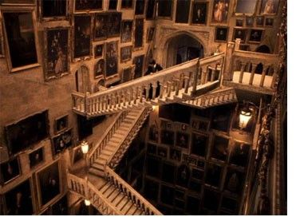

## Ball

The Quaffle (used in Harry Potter's Quidditch) is made of leather

  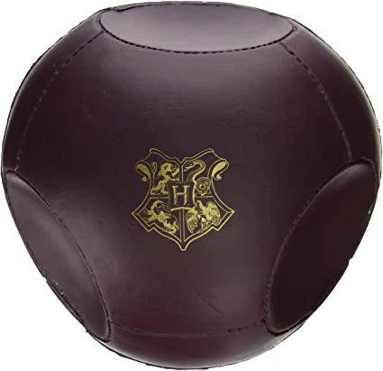
  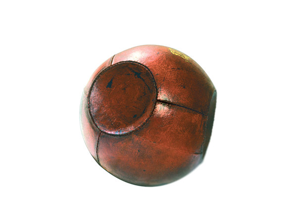

## Frames

The plan is to enclose the impossible staircase in an enclosed room, with frames of various sizes on the walls. 

I hope to project looped images on the walls to emulate the magical portraits in Harry Potter.

  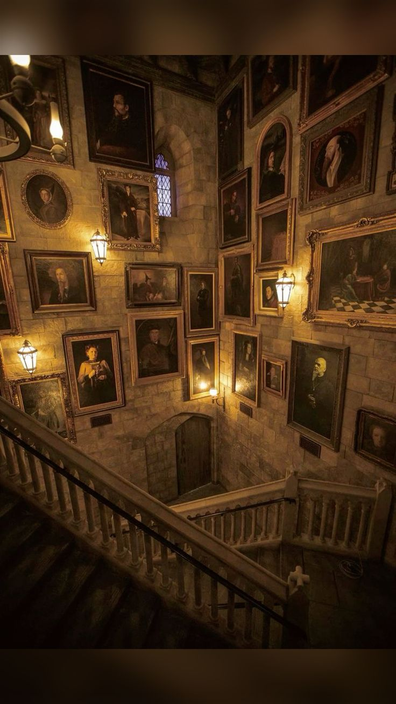
  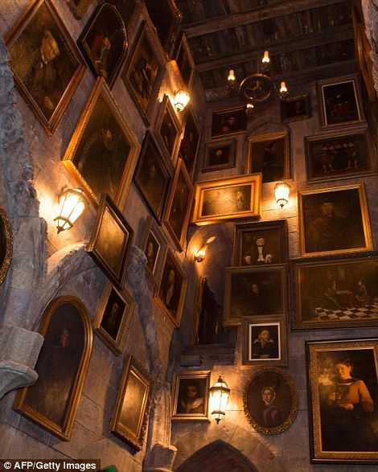 
  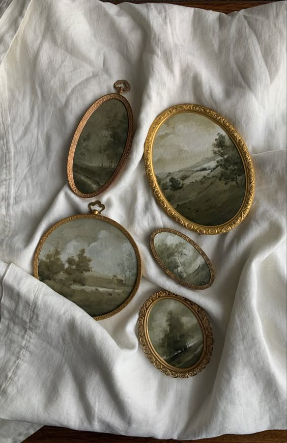 
  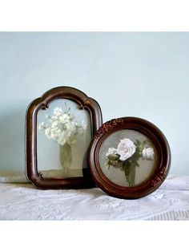 

## Banisters

  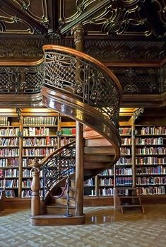 
  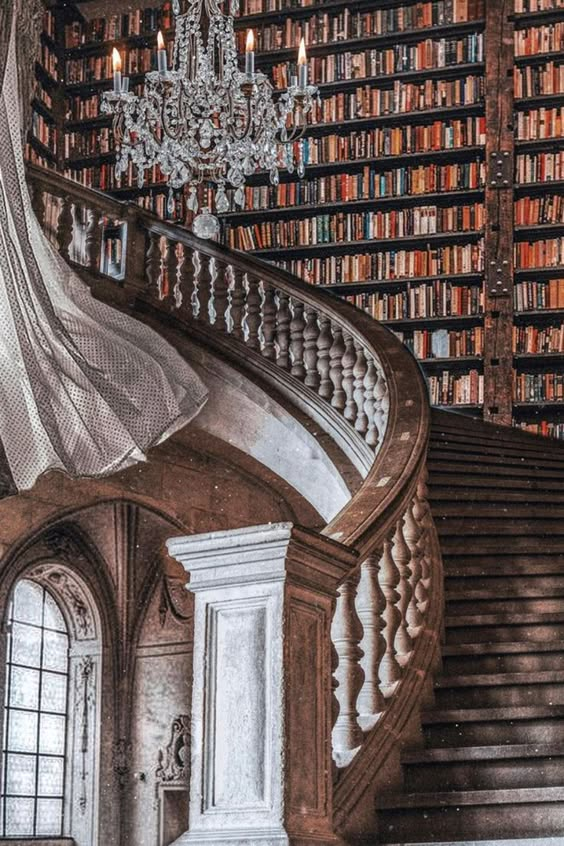
  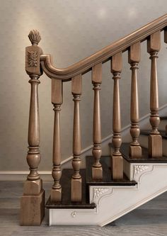
  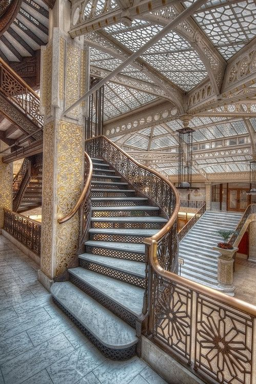 
  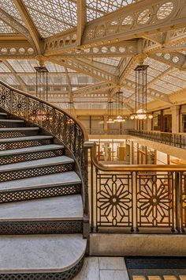
  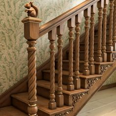
  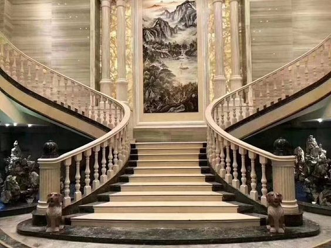

## Hallway

I plan to create an opening in the wall (either there the whole time, or ones that magically form and disappear). The plan is to have the ball bounce in/out of the scene through these hallways. It would also be cool to have either additional staircases that moved as in the movies, or if the impossible staircase moved out of the illusion into the hallway(s) at the end of the ten seconds.

  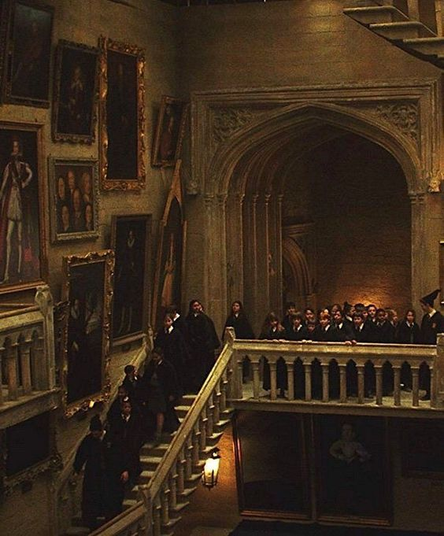 
  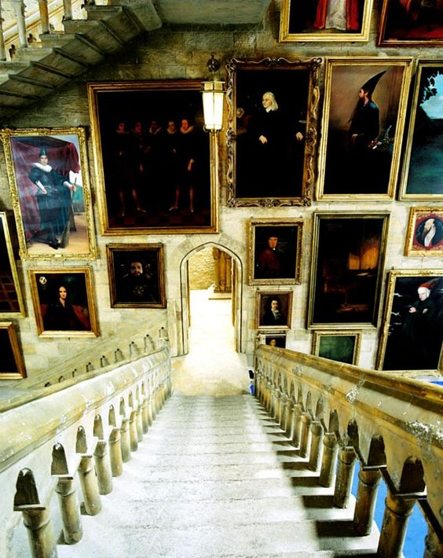
  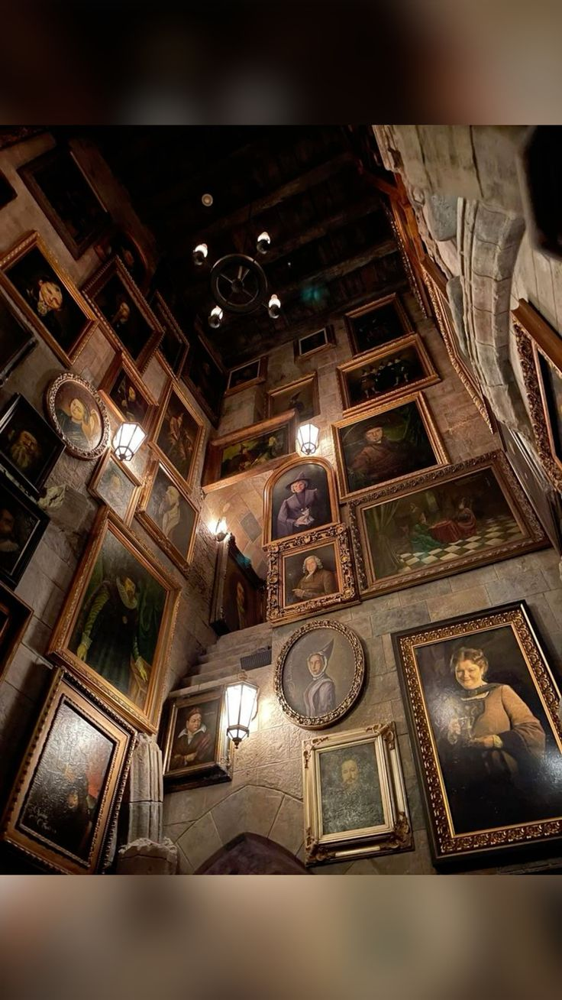
  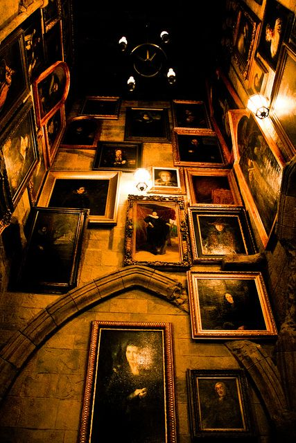
  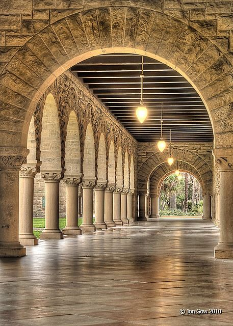
  
  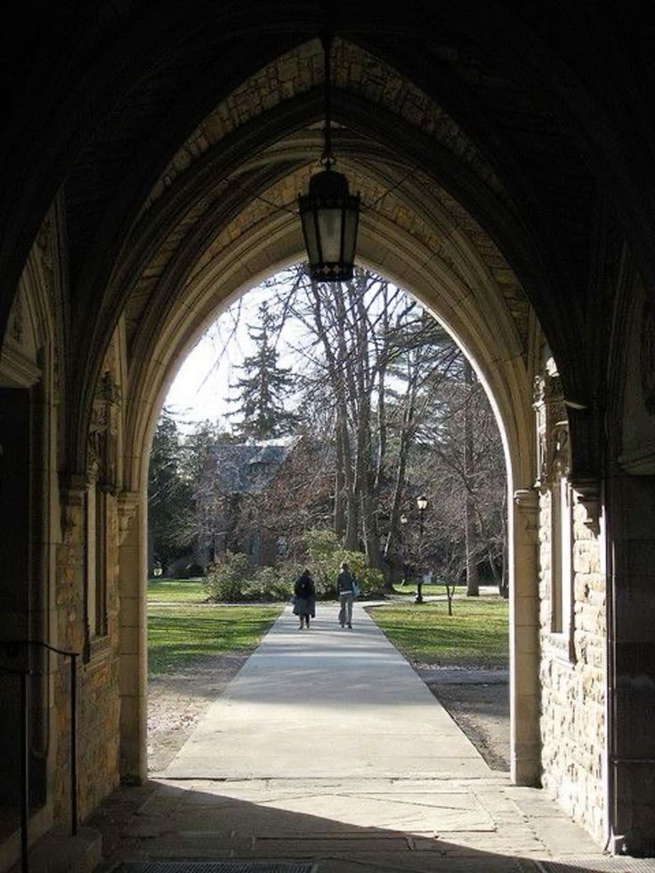

## Windows

If there is time to create windows.

  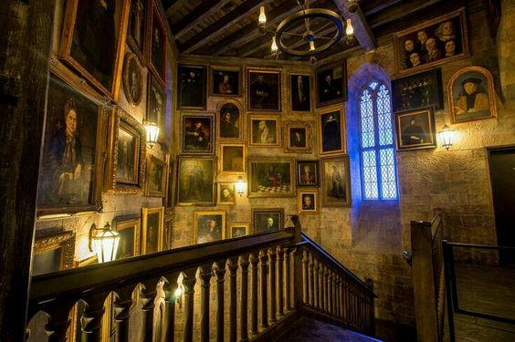 
  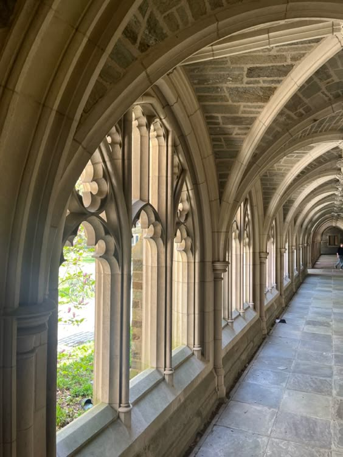

## Misc.

### suggested refs to look up
guggenheim museum frank lloyd wright
texture projection